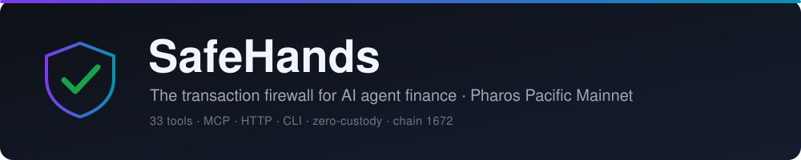
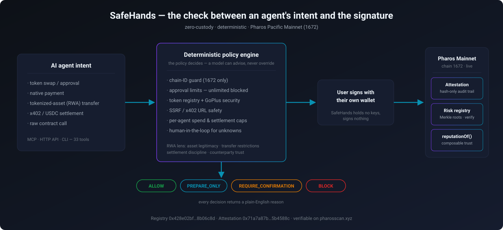

<p align="center">
  
</p>

# SafeHands

**The transaction firewall for AI agent finance on Pharos: deterministic `ALLOW` / `REQUIRE_CONFIRMATION` / `BLOCK` verdicts *before* a wallet signs.**

*No custody. No blind signing. Policy first, execution second.*

AI agents are starting to run real financial workflows on Pharos: payments, treasury actions, swaps, bridges, liquidity operations, and interactions with tokenized real-world assets. An agent doing that work can sign almost anything: an unlimited token approval, a swap on the wrong chain, a payment to a malicious x402 endpoint, a transfer of a tokenized asset to an unvetted counterparty. SafeHands is the firewall that stands *before* the signature. A deterministic policy engine analyzes each intent (calldata, token, spender, counterparty, amount, chain) and returns one of four verdicts (`ALLOW`, `BLOCK`, `REQUIRE_CONFIRMATION`, `PREPARE_ONLY`) with a plain-English reason. You act on your own wallet; SafeHands never holds keys and never signs for you.

In **hosted Anvita mode**, SafeHands provides no-custody, read-only safety verdicts; it does not sign, broadcast, or execute transactions today. In **self-hosted integrations**, the same policy model can gate execution itself. It ships as an MCP server, an HTTP API, and a CLI, exposing 33 tools that any agent in the Pharos ecosystem can call against Pharos Pacific Mainnet (chain `1672`).

[](https://github.com/SZtch/safehands-pharos/actions/workflows/ci.yml)


### Which SafeHands is for me?

One deterministic policy engine, delivered where you need the verdict: from a zero-infra hosted call to a self-hosted integration:

| You are… | Use | What it is |
|---|---|---|
| A **user or Steward agent** that wants a pre-execution verdict | the **Anvita Flow hosted skill** | Zero-infra, no keys, no custody: you get the verdict *before* you sign. The hosted deliverable in [`anvita/safehands/`](anvita/safehands/) (being published to Anvita). |
| A **developer** wiring safety into your own agent | the **npm package**: MCP server, CLI & SDK | `npx … --demo`, drop it into any MCP client, or `import { evaluateActionPolicy } from "safehands-pharos"`. The verdict path is the product; write tools are reference-only and stay gated behind env flags + a signer + the same verdict. |
| An **operator** who wants the HTTP API | the **self-hosted reference backend** | `node dist/api/server.js` → `http://localhost:4022`; free verdict endpoints plus the optional x402-gated `/paid/*` bundle. |

> **Read-only hosted mode is a security property, not a tier.** Because the hosted verdict layer holds no keys and signs nothing, every other agent can safely put it *in front of* their transactions: a firewall that can't move funds is one nobody has to trust with funds. Signing stays with you.

The compact hosted engine returns an `allow / warn / block` risk recommendation; the full policy engine (npm/API) returns the four-value decision. They map cleanly but score independently, and their thresholds intentionally differ: see [`docs/DECISION_CONTRACT.md`](docs/DECISION_CONTRACT.md), and never compare raw scores across them.

## SafeHands on Anvita Flow

SafeHands is packaged as a fully-hosted, zero-infrastructure Service Agent for [Anvita Flow](https://flow.anvita.xyz/home) (Pharos Agent Carnival, Phase 2): a Steward Agent asks it about an action and gets a deterministic verdict back *before* anything is signed. No server, no keys, no custody anywhere in the running system. The hosted package lives in [`anvita/safehands/`](anvita/safehands/), a Pharos Skill powered by a zero-dependency deterministic risk engine ([`safehands-engine.js`](anvita/safehands/scripts/safehands-engine.js)). Every verdict is computed by code, not guessed by an LLM; the AI layer only handles conversation, and every analysis links to [Pharosscan](https://www.pharosscan.xyz) so users verify the evidence themselves. Full integration guide: **[docs/ANVITA_FLOW.md](docs/ANVITA_FLOW.md)**.
<!-- after publish: replace "being published" wording repo-wide with the live marketplace link + "tell your Steward: go find SafeHands" -->

---

## Try it in 10 seconds

**One command, zero infrastructure**: no config, no wallet, no keys, no transactions:

```bash
npx -y github:SZtch/safehands-pharos --demo
# (after npm publish: npx safehands-pharos --demo · or locally: git clone → npm install → node dist/index.js --demo)
```

Watch the deterministic policy engine issue real safety decisions (`ALLOW`, `BLOCK`, `REQUIRE_CONFIRMATION`) against Pharos Pacific Mainnet. It runs twelve deterministic safety checks in your terminal (wallet health, policy decisions, token-registry lookups, x402 preflight, SSRF blocking, risk scoring, RWA transfer-compliance and settlement-cap scenarios) and touches nothing on-chain. The full check list and expected outputs are in [docs/REVIEWER_QUICKSTART.md](docs/REVIEWER_QUICKSTART.md).

<details>
<summary>Sample output: one of the twelve checks</summary>

```text
$ npx safehands-pharos --demo

🛡️  SafeHands-Pharos Deterministic Demo
   Environment: pacific-mainnet
   Chain ID: 1672
   Mode: non-destructive demo, no real transactions broadcast

  3. Unlimited Approval Preflight: BLOCK

safehands_preflight_check
{
  "success": true,
  "data": {
    "decision": "BLOCK",
    "riskLevel": "HIGH",
    "safeToExecute": false,
    "reasons": ["Unlimited approval requested."],
    "requiredActions": ["Use a limited approval amount."]
  },
  "error": null
}
```

</details>

## Run the API yourself (optional self-host)

To exercise the HTTP API directly, self-host the zero-custody reference backend locally against Pharos Pacific Mainnet; no API key needed for the public surface:

```bash
npm install --include=dev && npm run build
node dist/api/server.js   # read-only API on http://localhost:4022 (PORT env to change)
```

```bash
# Health + network config
curl -s http://localhost:4022/health
curl -s http://localhost:4022/public-config

# Real preflight decision from the live policy engine
curl -s -X POST http://localhost:4022/tools/safehands_preflight_check \
  -H "content-type: application/json" \
  -d '{"actionType":"approve_token","chainId":1672,"approvalToken":"USDC","spender":"0x000000000000000000000000000000000000dEaD","approvalAmount":"max"}'

# On-chain reputation read (live attestation contract)
curl -s -X POST http://localhost:4022/tools/get_agent_reputation \
  -H "content-type: application/json" \
  -d '{"address":"0x6730d3a2A217108AB53CCFe60ffdAd05D3C124e5"}'

# x402-gated endpoint. Fail-closed by default: without x402 config this returns 503.
# With X402_PAY_TO and a reachable external X402_FACILITATOR_URL set, it returns a
# real HTTP 402 challenge (mainnet USDC, eip155:1672).
curl -s -i http://localhost:4022/paid/risk-report
```

Interactive browser demo (while the local API runs): **http://localhost:4022/demo**. Full curl walkthrough: [docs/SAFEHANDS_REVIEWER_DEMO_SCRIPT.md](docs/SAFEHANDS_REVIEWER_DEMO_SCRIPT.md).

---

## What it does

SafeHands sits between an agent's *intent* and the *signature*. Before any action, the agent calls `safehands_preflight_check` (or one of the specialized preflight tools) and gets back a decision:

<p align="center">
  
</p>

The decision is **deterministic**: the policy engine decides, not a model. An LLM can advise, but it cannot override a policy it dislikes.

### What it catches

| Risk | Without SafeHands | With SafeHands |
|------|-------------------|----------------|
| Unlimited token approval | Agent grants a malicious spender forever | `BLOCK`: unlimited approvals off by default |
| Unsupported chain | Agent targets a non-Pharos network (e.g. Ethereum) | `BLOCK`: chain-ID guard |
| Malicious x402 endpoint | Agent pays a localhost / private-IP URL | `BLOCK`: SSRF + redirect guard |
| Wallet drain | Agent overspends in one session | `BLOCK`: per-agent + daily spend cap |
| Unknown token | Agent swaps an unverified contract | `REQUIRE_CONFIRMATION` |
| Arbitrary contract call | Agent calls an unknown contract | `REQUIRE_CONFIRMATION` |
| Bad input | Agent passes `-1` or the zero address | `VALIDATION_ERROR` |
| Unregistered tokenized asset | Agent approves an unknown asset contract to an unverified spender | `REQUIRE_CONFIRMATION`: human review required |
| Oversized settlement | Agent settles a real-world invoice above the policy cap | `BLOCK`: deterministic spend limit |

## Why this matters for Real-Fi & RWA

Pharos is a Real-Fi chain: the environment where agent-driven payments, treasury operations, and tokenized real-world assets settle. Those assets carry obligations memecoins do not (asset legitimacy, transfer restrictions, audit trails, settlement discipline, counterparty trust), and an agent can repeat a mistake a thousand times. SafeHands is the pre-execution safety layer for exactly those obligations: the read/policy path is live on mainnet today, and the write-side attestation path is a working opt-in. Demo scenarios 11-12 show the RWA flows end-to-end; the full live-vs-roadmap mapping is in **[docs/REALFI_RWA_ALIGNMENT.md](docs/REALFI_RWA_ALIGNMENT.md)**.

## What it is, and is not

SafeHands is a **transaction firewall**, not a wallet. It is not a custody service, a private-key manager, a signer, a DEX, or a bridge. It does not issue tokenized assets, does not manage real-world assets, and is not a compliance authority: it is the deterministic checkpoint agent-finance flows run through before execution. It renders the verdict; you keep the signature.

**Today, hosted (Anvita Flow):** a read-only, zero-custody pre-execution verdict. It holds no keys, signs nothing, broadcasts nothing, and executes nothing. You always sign and send with your own wallet.

**Advanced, self-hosted integration (MCP / CLI / SDK / HTTP API):** the same verdict engine, embeddable in your own agent. Execution tools (`execute_swap`, `send_payment`, `approve_token`, …) exist in the codebase as a **reference** for how a signing path binds to the verdict: every write is gated by the policy engine plus the write-execution gate (`actionPolicyEngine` is the sole ALLOW/BLOCK decider; `writeExecutionGate` refuses to proceed without a passing verdict wired in). They are **OFF by default, experimental, and unaudited**, run **self-hosted and single-tenant only**, and the public server refuses to enable them: a boot guard fails fast if managed execution is configured on a public host. The audited, production surface is the read-only verdict layer.

## Execution modes

| Mode | Key / wallet | Where it runs | Use for |
|------|--------------|---------------|---------|
| **Read-only preflight** *(default)* | none | hosted or local | Safety checks, risk analysis, demos |
| **User-signed** | your own wallet | anywhere | SafeHands validates; you sign externally, then it verifies + relays the broadcast |
| **Managed execution** | local encrypted wallet | self-hosted only | Full agent autonomy on mainnet, opt-in |
| **Env wallet** *(advanced)* | `PRIVATE_KEY` in env | local dev | Local mainnet development |

Read-only usage needs no `.env`, no private key, and no authorization.

---

## Install

```bash
npx skills add SZtch/safehands-pharos
```

### Claude Desktop (or any MCP client)

Add to `claude_desktop_config.json` and restart. The default is read-only, with no keys, wallet, or setup:

```json
{
  "mcpServers": {
    "safehands": {
      "command": "npx",
      "args": ["-y", "github:SZtch/safehands-pharos"]
    }
  }
}
```

Then ask: *"Run a SafeHands preflight on this payment."*

To run **self-hosted managed execution** on your own machine, add an `env` block (`WALLET_MODE=managed-mainnet`, `WRITE_TOOLS_ENABLED=true`). SafeHands creates a local AES-256-GCM-encrypted wallet on first run; you fund it from a faucet and authorize it before write tools unlock. See [.env.example](.env.example) and [docs/PRODUCTION_BACKEND.md](docs/PRODUCTION_BACKEND.md).

### CLI

```bash
npx github:SZtch/safehands-pharos skill safehands_preflight_check \
  '{"actionType":"approve_token","chainId":1672,"approvalToken":"USDC","spender":"0x000000000000000000000000000000000000dEaD","approvalAmount":"max"}'
```

Every tool returns the same envelope: `{ "success": true, "data": { … }, "error": null, "timestamp": "…" }`.

## The 33 tools

One policy engine behind MCP, HTTP, and CLI. The safety-preflight, risk, and market/chain tools are public and keyless; execution tools are OFF by default behind env gates plus the policy verdict. Full catalog: **[docs/TOOLS.md](docs/TOOLS.md)**.

## Per-agent policy

Different agents can carry different risk thresholds (`conservative` / `balanced` (default) / `advanced` / `custom`). Hard safety rules (mainnet guard, zero address, SSRF, unauthorized managed execution) are never overridable by any profile. Policies live in `.agents/policies/`; raising a limit requires an explicit saved config, so runtime or prompt injection cannot silently widen it. Profile limits: **[docs/POLICY_PROFILES.md](docs/POLICY_PROFILES.md)**.

## x402

SafeHands makes agent-driven x402 payments safer by validating the HTTP 402 requirement before anything is signed or settled:

- `safehands_x402_preflight`: no payment, no auth, URL + amount safety
- `x402_pay_and_fetch`: gated execution behind policy limits
- SSRF and redirect-SSRF are blocked; payment amount, token, and per-agent caps are enforced
- Replay/idempotency is backed by a durable store (Upstash Redis when configured, local JSON fallback)

## On-chain registry + attestation

SafeHands deploys two contracts to Pharos Pacific Mainnet: a **registry** (authorized operators/agents, Merkle risk roots, `verifyRiskRecord` view) and an **attestation** contract (privacy-preserving verified-safe records + reputation).

| | |
|---|---|
| Registry | [`0x428e02bf85412e7242d991cd6725ec59e8b06c8d`](https://www.pharosscan.xyz/address/0x428e02bf85412e7242d991cd6725ec59e8b06c8d) |
| Attestation | [`0x71a7a87b3b1ab6d86204cad691bb32fd75b4588c`](https://www.pharosscan.xyz/address/0x71a7a87b3b1ab6d86204cad691bb32fd75b4588c) |
| Network | Pharos Pacific Mainnet (chain `1672`) |
| Source | `contracts/SafeHandsRegistry.sol`, `contracts/SafeHandsAttestation.sol` |

When the attested-broadcast path is enabled and a user-signed transaction is broadcast successfully, SafeHands writes an attestation on-chain: hashed context only (`preparedTransactionHash`, `policyHash`, `metadataHash`) plus the `txHash`, never raw calldata, keys, amounts, recipients, or intent. Attestation gas is paid by a dedicated `SAFEHANDS_ATTESTER_PRIVATE_KEY` separate from any user wallet. The backend reads the contract addresses from `SAFEHANDS_REGISTRY_ADDRESS` / `SAFEHANDS_ATTESTATION_ADDRESS`, so you can point at your own redeploy without touching code.

## Network

| | Pharos Pacific Mainnet |
|---|---|
| Chain ID | `1672` |
| Native token | `PROS` |
| RPC | `https://rpc.pharos.xyz` |
| Explorer | `https://www.pharosscan.xyz` |

Pharos Atlantic Testnet (`688689`) remains readable for legacy checks but is deprecated for execution.

## Security defaults

SafeHands ships closed. Nothing runs without an explicit opt-in:

- `WRITE_TOOLS_ENABLED=false`: no write tools
- `WALLET_MODE=none`: no wallet created (`managed-mainnet` is opt-in, self-hosted only)
- Unlimited approvals blocked
- Mainnet execution disabled until write/signing env gates are set
- SSRF-sensitive URLs blocked
- Private keys never returned in responses or logs
- Per-agent policy limits and daily spend caps enforced
- Managed execution gated by on-chain registry authorization
- A boot guard refuses managed/write execution on a public host

---

## Testing

```bash
npm run build           # compile
npm test                # hermetic deterministic suite (policy, x402 gate, write-auth, risk-inclusion; no network)
npm run demo            # live safety checks in the terminal
npm run test:contracts  # Hardhat contract tests (offline smoke fallback)
npm run test:all        # build + test + demo + contracts
```

`npm test` needs no wallet, key, or network and never broadcasts. Live read-only RPC checks run separately via `npm run test:live`. The live user-signed broadcast path is opt-in (`SAFEHANDS_USER_SIGNED_BROADCAST_ENABLED=true SAFEHANDS_LIVE_BROADCAST_TEST=true npm run test:live-broadcast`).

## Configuration

Read-only preflight works with **no `.env` at all**. Every write/execution/attestation capability is opt-in behind an env flag. The full annotated reference (network, safety gates, managed execution, attestation, x402, production hosting) is in **[.env.example](.env.example)**; self-host operations are in **[docs/PRODUCTION_BACKEND.md](docs/PRODUCTION_BACKEND.md)**.

## Known limitations

- Managed-wallet encryption is AES-256-GCM, not KMS/Vault-grade; not intended for custody of large amounts.
- User-signed broadcast (`POST /broadcast/signed`) is live but disabled by default; without `SAFEHANDS_USER_SIGNED_BROADCAST_ENABLED=true` it runs verify-only.
- GoPlus token security does not cover Pharos testnet (`688689`). On Pacific Mainnet (`1672`) GoPlus coverage is still new: tokens it has not yet indexed return a fail-closed `UNVERIFIED` result (never "safe").
- Canonical token prices come from Chainlink Push Engine feeds on Pharos Pacific Mainnet. If the public RPC is temporarily rate-limited, SafeHands may serve a clearly flagged bounded cached oracle value; stale feeds fail closed.
- DODO / FaroSwap route checks can occasionally lack liquidity for exotic pairs; this affects pool/route/swap tooling, not canonical `get_token_price`.

## Roadmap

The goal: be the safety decision every AI agent consults *before* it acts on-chain. One rule holds throughout: **the safety verdict stays deterministic. The model advises; the policy engine decides.** The arc is a single verdict engine moving from *advising* an action (hosted, today) to *gating* it (verdict-bound signing) without the safety logic ever changing.

**Shipped (v2.4.1):** 33-tool agent surface across MCP, HTTP, and CLI; hosted Anvita engine at read-path capability parity (offline calldata/approval decoding, dangerous-admin recognition, MultiSend aggregation, operator recipient denylist); deterministic policy engine (mainnet guard, approval limits, SSRF guard, spend caps); registry + attestation contracts live on Pharos Pacific Mainnet; GoPlus token-security and Goldsky indexing; x402 preflight and gated `pay_and_fetch`.

**Next:** L1 risk-root committer automation, a data-availability serving endpoint, broader cross-agent reputation reads, and compliance-provider integrations for RWA flows (TRM Labs screening, Circle CCTP settlement; currently roadmap, not integrated).

**Contracts v2 (designed, not scheduled):** committed-root history, content-addressed data availability (IPFS CID instead of a mutable URL), verdict revocation, reproducible verdicts, and intent tickets that bind a verdict to one exact transaction. Full reasoning: **[docs/CONTRACTS_V2_DESIGN.md](docs/CONTRACTS_V2_DESIGN.md)**.

---

## License

MIT © [SZtch](https://github.com/SZtch)
