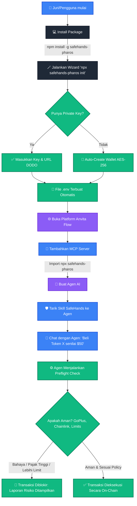

# Alur Pengguna (User Flow) SafeHands Pharos

Untuk membantu Anda (dan Juri Hackathon) memahami bagaimana produk ini digunakan dari awal hingga akhir, berikut adalah visualisasi dan penjelasan lengkap tentang Alur Pengguna (*User Flow*).

## Visualisasi Alur

## Penjelasan Langkah-demi-Langkah

### Tahap 1: Instalasi & Onboarding (Terminal)
Ini adalah tahap pertama saat juri menguji proyek Anda.
1. Juri menjalankan perintah instalasi di terminal mereka.
2. Juri mengetik `npx safehands-pharos init`.
3. Terminal akan interaktif bertanya kepada juri (seperti sedang mengobrol) untuk mengatur konfigurasi. Jika juri malas memasukkan *Private Key*, sistem otomatis membuatkan dompet terenkripsi (AES-256) untuk mereka. Hasil akhirnya: **File `.env` tercipta dengan rapi tanpa perlu edit manual**.

### Tahap 2: Integrasi ke Platform AI (Anvita Flow)
Setelah terminal siap, juri pindah ke platform visual.
1. Juri membuka **Anvita Flow** (atau Claude Desktop).
2. Di pengaturan MCP, juri menambahkan server baru dengan perintah `npx safehands-pharos`.
3. Secara ajaib, **30 Skill** (Pengecek GoPlus, Harga Chainlink, Eksekusi, x402) akan muncul di layar Anvita Flow sebagai balok-balok fungsional.
4. Juri menarik dan menghubungkan balok-balok skill tersebut ke *Agent Node* mereka.

### Tahap 3: Interaksi & Keamanan (Agent Arena)
Ini adalah puncaknya. Juri sekarang bertindak sebagai *End-User* yang mengobrol dengan Agen AI.
1. Juri mengetik di kolom chat: *"Tolong belikan saya token X senilai $50"*.
2. Agen AI akan memanggil `safehands_preflight_check`.
3. **Di Balik Layar (Backend)**: SafeHands secara otomatis menarik harga dari **Chainlink Oracle**, mengecek kontrak Token X di **GoPlus**, dan memastikan harganya di bawah $50.
4. **Hasil**:
   - Jika Token X adalah *honeypot*, agen akan membalas: *"Maaf, transaksi saya hentikan karena Token X terdeteksi sebagai penipuan oleh GoPlus."*
   - Jika aman, agen akan memanggil `execute_swap`, menandatangani transaksi, dan mencetak *hash* kesuksesan dari Pharos Mainnet.

## Mengapa Alur Ini Sangat Bagus?
Alur ini dirancang agar **Juri tidak perlu menyentuh satu baris kode pun** (Zero-Code Experience). Dari menginstal hingga mengeksekusi transaksi mainnet, semuanya dipandu oleh *Wizard* dan divisualisasikan oleh *Anvita Flow*. Inilah definisi dari produk siap pakai (*Production-Ready*).
